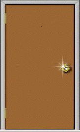

<title>Monty Hall Problem</title>

<h2>Monty Hall Simulation</h2>
 
<strong>Click on a door to begin the simulation.</strong>
  
<body onload="getImages()">

 
 <!-- Number of Doors &nbsp; --><input name="NumberofDoors" type="hidden" id="NofDoors" dir="ltr" value="3" size="5" onclick="this.select()" autofocus=""> 
 
 <input type="button" name="tryagain" id="again" value="Try Again" onclick="setnumberofdoors()" > <b>Note</b> - This will not reset your current stats.
 
    

 
 &nbsp;<b>Switch Trials</b>     
     &nbsp; Number of 'Switch' Trials: <input name="type=&quot;text&quot;" id="switch_trials" size="5" value="0">
     
    &nbsp; Number Correct: <input name="type=&quot;text&quot;" id="switch_correct" size="5" value="0">
      
    &nbsp; Number Incorrect: <input name="type=&quot;text&quot;" id="switch_incorrect" size="5" value="0">
      
    &nbsp; Proportion Correct: <input name="type=&quot;text&quot;" id="switch_proportion" size="5" value="0">
 
   <b> 
    
   &nbsp;Stay Trials</b>     
   &nbsp; Number of 'Stay' Trials: <input name="type=&quot;text&quot;" id="stay_trials" size="5" value="0">
    
    &nbsp; Number Correct: <input name="type=&quot;text&quot;" id="stay_correct" size="5" value="0">
      
  &nbsp;   Number Incorrect: <input name="type=&quot;text&quot;" id="stay_incorrect" size="5" value="0">
      
  &nbsp;   Proportion Correct: <input name="type=&quot;text&quot;" id="stay_proportion" size="5" value="0">
      
    

 <!--   &nbsp;<input type="button" value="Clear Data" onclick="resetValues();setnumberofdoors()">  
        &nbsp; <input type="button" value="Show Explanation" onclick="document.getElementById(&#39;explanation&#39;).style.visibility=&#39;visible&#39;">  
 
       -->
      
    <b>Caution</b> - The Reset Stats <b>will</b> reset your current stats with no way to recover them. 
       Note your progess before resetting.
     
    <input type="button" value="Reset Stats" onclick="resetValues();setnumberofdoors()">

     

 
This page was created using a similar simulation. Please visit the <a href="http://onlinestatbook.com"> onlinestatbook</a> site cited below for other statistical simulations and explanations.  
<a href="http://onlinestatbook.com/2/probability/monty_hall_demo_html5/monty_hall.html"> Original Simulation</a> 

Online Statistics Education: A Multimedia Course of Study (http://onlinestatbook.com/). Project Leader: David M. Lane, Rice University.

</body></html>